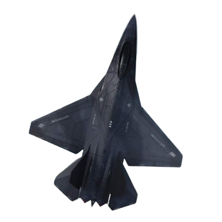

    

    

 
 

  

 
  <a href="https://intercept.cc">Documentation (WIP)</a> / 
  <a href="https://github.com/xfhg/intercept?tab=EUPL-1.2-1-ov-file">License</a> / 
  <a href="https://github.com/xfhg/intercept?tab=security-ov-file">Security</a> / 
  <a href="https://github.com/xfhg/intercept/releases">Latest Release</a> / 
  <a href="https://github.com/xfhg/intercept/pkgs/container/intercept">Package v1.0.X</a>

    
    
    

<!-- 

-->

